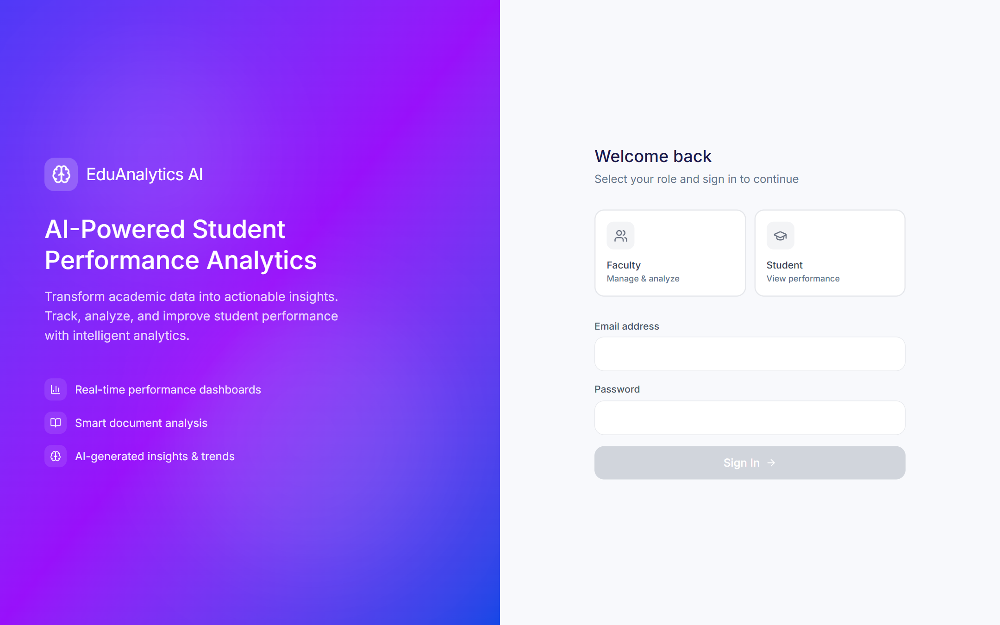
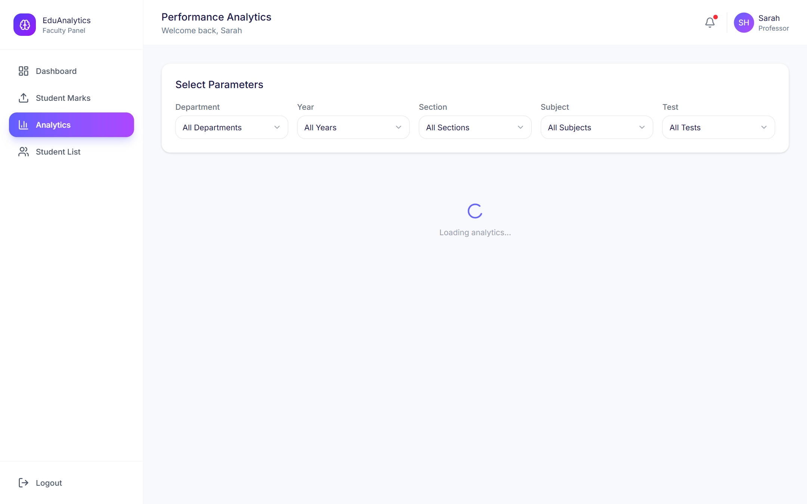
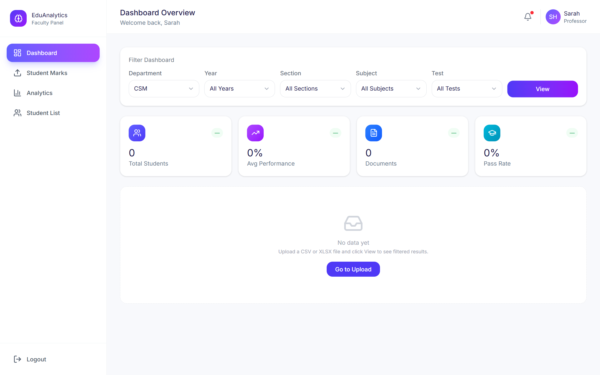
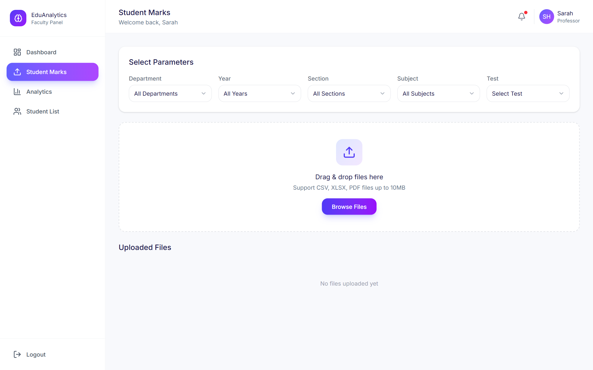
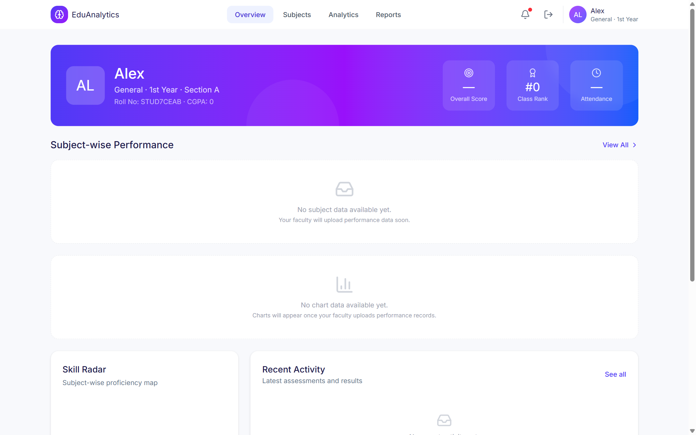

# 📊 AI Student Performance Dashboard & Predictive Analytics Engine

An intelligent, full-stack student performance tracking and predictive analytics system designed for academic institutions. The application parses student records, generates rich visual insights, and uses machine learning (Scikit-Learn) to identify at-risk students, predict final grades, and track academic growth.







---

## 🌟 What It Does

- **🤖 Machine Learning Risk Predictor**: Uses Scikit-Learn regression and classification algorithms to predict student final grades, pass probabilities, and automatically flag at-risk students based on mid-term performance, attendance, and assignment scores.
- **👨‍🏫 Faculty Analytics Hub**: KPI cards displaying overall pass rates, average CGPA, class size metrics, section comparisons, and student document ingestion tools.
- **📈 Interactive Data Visualizations**: Real-time visual dashboards built with **Recharts** featuring grade distribution charts, section score comparisons, attendance trend lines, and multi-axis performance radars.
- **📁 Automated File Parsing**: Instant data extraction from uploaded Excel spreadsheets (`.xlsx`) and PDF academic transcripts (`.pdf`) using `openpyxl` and `pdfplumber`.
- **🎓 Student Portal**: Individual student dashboards featuring class rank, attendance tracking, cumulative GPA progress, and skill radar comparisons against class averages.
- **🔒 Role-Based Security**: Complete access control supporting **Admin**, **Faculty**, and **Student** roles with JWT authentication.

---

## 🛠️ Tech Stack

### **Frontend**
- **Framework**: React 19 + TypeScript 5.8
- **Build Tool**: Vite
- **Styling**: Tailwind CSS + Glassmorphism UI Components
- **Data Visualization**: Recharts + Framer Motion
- **Icons**: Lucide React Icons

### **Backend**
- **Framework**: FastAPI (Python 3.12+)
- **Server**: Uvicorn
- **Machine Learning**: Scikit-Learn, Pandas, NumPy
- **Document Parsing**: `pdfplumber`, `openpyxl`
- **Database & ORM**: SQLAlchemy + SQLite (Local) / PostgreSQL Supabase (Production)
- **Deployment Spec**: Vercel Serverless Functions (`vercel.json`)

---

## 🚀 How to Run Locally

### **Prerequisites**
- **Node.js**: v18.0.0 or higher
- **Python**: v3.10 or higher

### **1. Install Frontend & Root Dependencies**
```bash
npm install
npm run install:frontend
```

### **2. Configure Backend Environment**
Create a `.env` file inside the `backend/` directory:
```env
DATABASE_URL=sqlite:///./test.db
SECRET_KEY=your_secret_jwt_key_here
```

### **3. Start Development Servers**
Launch both the React frontend and FastAPI backend concurrently from the root directory:
```bash
npm run dev
```

- **Frontend Application**: `http://localhost:5173`
- **FastAPI Interactive API Docs**: `http://localhost:8000/docs`

---

## ☁️ Deployment on Vercel

The application is pre-configured for one-click deployment on **Vercel**:

1. **Database Migration (Supabase SQL Editor)**:
   ```sql
   ALTER TABLE uploaded_files ADD COLUMN IF NOT EXISTS file_data TEXT;
   ALTER TABLE student_list_files ADD COLUMN IF NOT EXISTS file_data TEXT;
   ```
2. **Push Code to GitHub**: Connect your repository to Vercel.
3. **Configure Build Settings**:
   - **Framework Preset**: Other
   - **Root Directory**: `./`
   - **Build Command**: `npm run build`
   - **Output Directory**: `frontend/dist`
4. **Environment Variables**: Add `DATABASE_URL` (Supabase connection string) and `SECRET_KEY`.

---

## 📜 License

This project is licensed under the **MIT License**.
